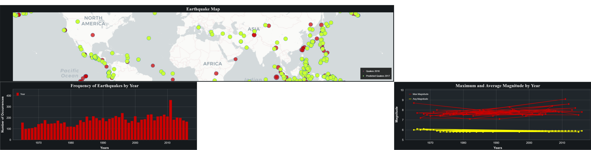

# Earthquake-Prediction-Dashboard-Server-using-Big-Data-Pipelines-A-Machine-Learning-Approach
 Built Big Data Pipeline using PySpark, MongoDB & Bokeh to develop earthquake prediction dashboard.
 Also plotted the predicted magnitude values along with actual magnitude values as shown in the below dasboard:
 
